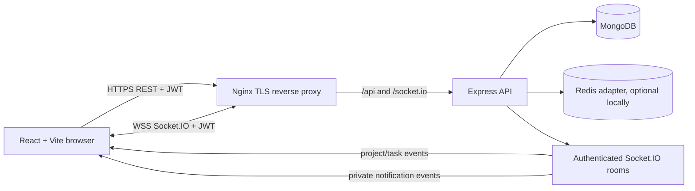
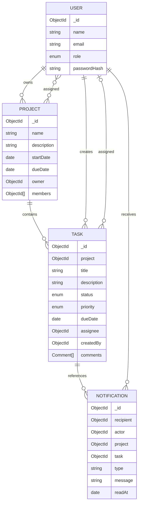

# System design

## Architecture

MongoDB is authoritative. The API validates and authorizes each write, persists it, then publishes the resulting event. Socket.IO uses authenticated private user rooms and membership-checked project rooms. Redis's adapter forwards broadcasts between backend instances. REST reads reconcile the browser after initial load or reconnect.

## Roles and authorization

- `admin` can list all projects/tasks, manage projects and team assignments, create/edit/delete tasks, and set assignees, status, priority, and deadline.
- `user` can list only projects where they are assigned and only tasks assigned to them. They can update status and add comments/attachments to those tasks.
- Public registration always sets `role: user`. The backend's `promote-admin` command promotes an already registered account. Never trust frontend role controls for authorization.
- Socket joins require a valid JWT and admin role or project membership. Assignment updates reconcile project room membership for connected users.

## Data model

Email is unique and normalized to lowercase; password hashes are excluded from normal queries. Project membership is an array of references. Task comments contain author, body, timestamps, and small base64 attachments. For larger production workloads, move files to object storage.

## REST API

All paths are prefixed with `/api`; protected routes require `Authorization: Bearer <token>`.

| Method | Endpoint | Purpose / access |
|---|---|---|
| POST | `/auth/register` | Register a user; role is always user |
| POST | `/auth/login` | Authenticate and return role-aware session |
| GET | `/auth/me` | Current account |
| GET | `/users` | List accounts; admin |
| GET | `/projects` | Admin: all projects; user: assigned projects |
| GET | `/tasks` | Admin: recent workspace tasks; user: assigned tasks for the dashboard |
| POST | `/projects` | Create project with dates and user assignments; admin |
| GET/PATCH/DELETE | `/projects/:projectId` | Read accessible project; mutate as admin |
| POST/DELETE | `/projects/:projectId/members...` | Assign/unassign project members; admin |
| GET | `/projects/:projectId/tasks` | Admin: all; user: assigned tasks only |
| POST | `/projects/:projectId/tasks` | Create task; admin |
| PATCH | `/projects/:projectId/tasks/:taskId` | Admin: task fields; user: status only |
| PATCH | `/projects/:projectId/tasks/:taskId/status` | Change status; admin or assignee |
| POST | `/projects/:projectId/tasks/:taskId/comments` | Add comment and small attachments to accessible task |
| DELETE | `/projects/:projectId/tasks/:taskId` | Delete task; admin |
| GET | `/notifications` | Latest 50 and unread count |
| PATCH | `/notifications/:notificationId/read` | Mark own notification read |
| PATCH | `/notifications/read-all` | Mark all own notifications read |

Success responses wrap entities in `{ project }`, `{ task }`, `{ users }`, or `{ notifications, unreadCount }`. Errors use `{ error, details? }`.

## Socket events and notification delivery

The client sends its JWT in the Socket.IO handshake, joins project rooms returned by its API project list, and leaves rooms after unassignment. Project membership changes send private `project:added` / `project:removed` events so the client's room subscriptions stay aligned.

| Event | Direction | Effect |
|---|---|---|
| `project:join` / `project:leave` | client → server | Join after backend authorization / leave a project room |
| `project:created`, `project:updated`, `project:deleted` | server → project or user | Keep project list and detail current |
| `project:members-updated`, `project:added`, `project:removed` | server → project or user | Synchronize project membership |
| `task:created`, `task:updated`, `task:status-updated`, `task:deleted` | server → admin and relevant assignee private rooms | Synchronize authorized boards and summaries without exposing other assignees' task payloads |
| `task:comment-added` | server → admin and task assignee private rooms | Add a newly persisted comment to authorized task details |
| `notification:new` | server → `user:<id>` | Add persisted notification and increment unread count |

Notifications persist in MongoDB, so the notifications page reloads durable state after reconnect. Events are emitted only after successful writes; sockets are not write APIs. REST remains the recovery path because the system does not replay missed event history.

## State management and trade-offs

React component state plus a small workspace context is sufficient for these screens. `api.js` owns authenticated HTTP transport; `socket.js` owns connection creation. The server enforces access; client-side controls mirror roles for usability. Redis is optional for one local API process and required by the production startup guard. Small attachment data is stored in MongoDB for assignment simplicity; production deployments should use object storage, backups, and retention controls.
